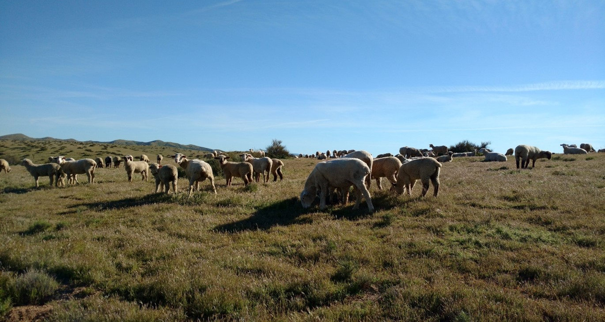

<br>  




### Load Libraries and Data
```{r warning=FALSE, message=FALSE}
## Load libraries
library(tidyverse)
library(ggthemes)

## Load functions
source("scripts//figureFormat.r")

## Load data on study information
studyData <- read.csv("data//StudyData.csv", stringsAsFactors = F)

## load all data on grazing and merge with simplified datasets
data <- read.csv("data//grazingData.csv", stringsAsFactors = F)
est <- read.csv("data//simpleCategories//estimateCategories.csv", stringsAsFactors = F)
graze <- read.csv("data//simpleCategories//grazingCategories.csv", stringsAsFactors = F)
data <- merge(data, est, by="Estimate", stringsAsFactors = F)
data <- merge(data, graze, by="grazing.estimate", stringsAsFactors = F)

```

### A distribution of where the studies took place
```{r warning=FALSE, message=FALSE}

## Remove sites without lat lon
gps <- studyData %>% filter(Latitude != "")

### Split multiple GPS coordinates for the same site
gpsSplit <- gps %>%   transform(Longitude = strsplit(Longitude, ";")) %>%   transform(Latitude = strsplit(Latitude, ";"))  %>%   unnest(Longitude, Latitude) %>% ## unnest lat/lon 
  mutate(Latitude = as.numeric(Latitude), Longitude=as.numeric(Longitude))


require(ggmap)
require(maps)
###  Start with base map of world
mp <- NULL
mapWorld <- borders("world", colour="white", fill="gray75") # create a layer of borders
mp <- ggplot() + theme_classic()+  mapWorld + xlim(-180,180)

mp <- mp+ geom_point(data=gpsSplit %>%  filter(Grazer.status != "") , aes(x=Longitude, y=Latitude, fill=Grazer.status), size=3, pch=21) + scale_fill_manual(values=c("#D55E00", "#009E73", "#56B4E9","grey50")) + ylab("Latitude") + xlab("Longitude") 
mp

```


### Visualize patterns among studies
```{r warning=FALSE, message=FALSE}
## Replicates
names(studyData)
plot1 <- ggplot(studyData, aes(x = as.numeric(N.sites))) + geom_histogram(fill="Grey50", bins=10) + theme_Publication() + xlab("Number of sites") + ylab("Frequency of studies") + scale_x_continuous(trans =  "log2")

plot2 <- ggplot(studyData, aes(x = as.numeric(Study.duration))) + geom_histogram(fill="Grey50",bins=10) + theme_Publication() + xlab("Duration of study in years") + ylab("Frequency of studies")+ scale_x_continuous(trans =  "log2")

gridExtra::grid.arrange(plot1, plot2, ncol=2)

# studyData$n.sites <- as.numeric(studyData$n.sites)
# 
# nstudies <- function(x){
# nfilt <- studyData %>% filter(study.duration > x) %>%  nrow()
# return(as.vector(nfilt))
# }
# 
# studiesSites <- unlist(sapply(1:30, nstudies))
# studiesYears <- unlist(sapply(1:30, nstudies))
# studiesList <- data.frame(rep=c(1:30,1:30), type= c(rep("years",30),rep("sites",30)), nstudies = c(studiesYears, studiesSites))
# 
# ggplot(studiesList, aes(x=rep, y=nstudies, color=type)) +geom_point()
```

### Pattern among Vegetation Classes
```{r warning=FALSE, message=FALSE}
## Split by semi-colon
unnestVeg <- studyData %>%   unnest(Ecosystem.class = strsplit(Ecosystem.class, ";"))
## Summarize by each class
VegClass <- unnestVeg %>% group_by(Ecosystem.class) %>% summarize(n=length(Ecosystem.class)) %>% filter(!is.na(Ecosystem.class))


## Capitalize the names of each
VegClass[,"capitalVegClass"] <- str_to_title(VegClass$Ecosystem.class)

ggplot(VegClass, aes(x=capitalVegClass, y=n)) + geom_bar(stat="identity") + theme_Publication() + xlab("") + ylab("Number of studies") + coord_flip()

```

### Most common grazers
```{r warning=FALSE, message=FALSE}
## Split by semi-colon
unnestGraze <- studyData %>%   unnest(Herbivores = strsplit(Herbivores, ";"))
## Summarize by each class
herbsum <- unnestGraze %>% group_by(Herbivores) %>% summarize(n=length(Herbivores)) %>% filter(!is.na(Herbivores)) 

## Simplified name
herbSimple <- read.csv("data//simpleCategories//herbsum.csv") %>% select(-n)
herbsum <- merge(herbsum, herbSimple) %>% group_by(simpleHerbivoreName) %>% summarize(n=sum(n)) 

topherb <- herbsum %>% top_n(20) %>% arrange(-n) ## select 10 most commonly surveyed
topherb

## Capitalize the names of each
topherb[,"simpleHerbivoreName"] <- str_to_title(topherb$simpleHerbivoreName)

ggplot(topherb, aes(x=reorder(simpleHerbivoreName, -n), y=n)) + geom_bar(stat="identity") + theme_Publication() + xlab("") + ylab("Number of studies") + coord_flip()

```

### Summary statistics of other categories
```{r warning=FALSE, message=FALSE}
studyData %>% group_by(Fenced) %>% summarize(n=length(UniqueID))
studyData %>% group_by(Tilled) %>% summarize(n=length(UniqueID))
studyData %>% group_by(Fire) %>% summarize(n=length(UniqueID))
studyData %>% group_by(Fertilization) %>% summarize(n=length(UniqueID))

```

### Comparisons of binary variables
```{r warning=FALSE, message=FALSE}


## Load packages and functions
library(reshape2)
library(metafor)
source("scripts//meta.evalSE.R")


## Reference data
meta <- data

## Create Unique identifier column
meta[,"UniqueSite"] <- paste(meta$UniqueID, meta$Higher.taxa, meta$Taxa, meta$Estimate, meta$SiteID, sep="-")

## convert se to sd
meta[meta$Stat=="StDev","Value"] <- meta[meta$Stat=="StDev","Value"] / sqrt(as.numeric(meta[meta$Stat=="StDev","replicate"] ))
meta[meta$Stat=="StDev","Stat"] <- "SE"

## drop comparisons that are not pairwise
meta <-  meta %>% filter(grazing.compare  == "ordinal/binary")

## Use function to extract summary statistics for comparisons
## meta.eval  arguments are (meta.data, compare, ids , stats)
grazed.compare <- meta.eval(meta, grazing.level, UniqueSite, Stat)

## Combine the lists into same dataframe
## Rename Columns in second dataframe
grazed.stat <- grazed.compare [[2]] ## extracted statistics 
names(grazed.stat) <- c("UniqueSite","grazed_mean","grazed_se","ungrazed_mean","ungrazed_se","grazed_n","ungrazed_n") ## rename columns to match
grazed.raw <- grazed.compare[[1]] ## calculated statistics from raw values
grazed.raw

  
```


### Which countries were most examined
```{r warning=FALSE, message=FALSE}
library(maps)
library(raster)
gpsSplit[,"countries"] <- map.where(x = gpsSplit$Longitude, y = gpsSplit$Latitude)

## Number of unique countries
gpsSplit %>% filter(!is.na(countries)) %>% summarize(n=length(unique(countries)))

```


